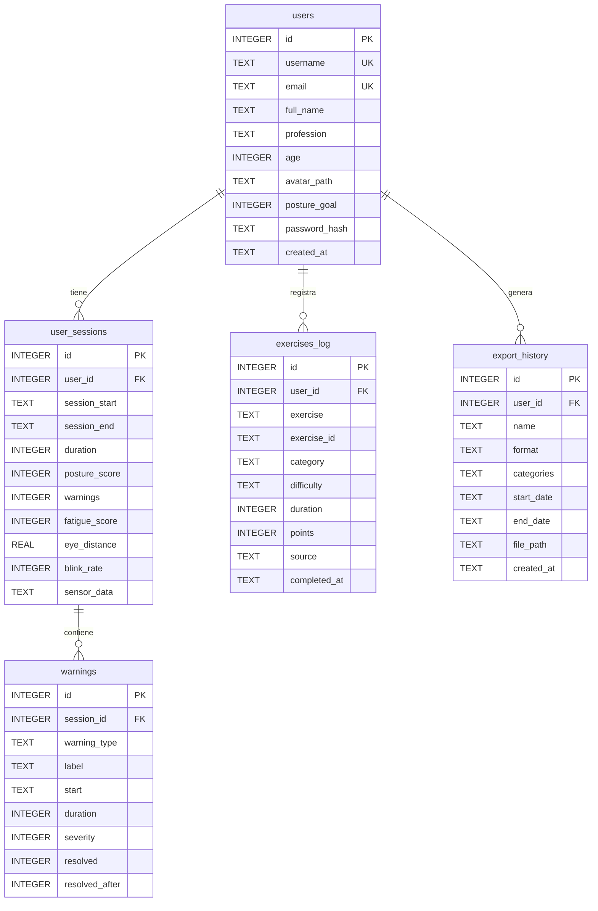
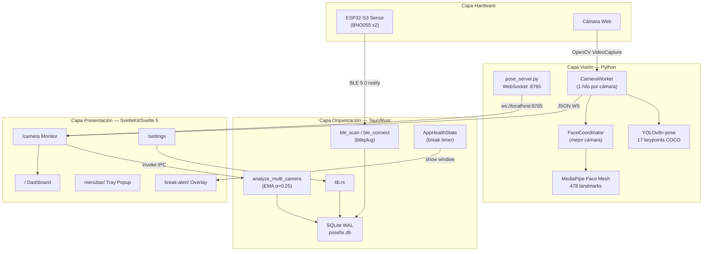
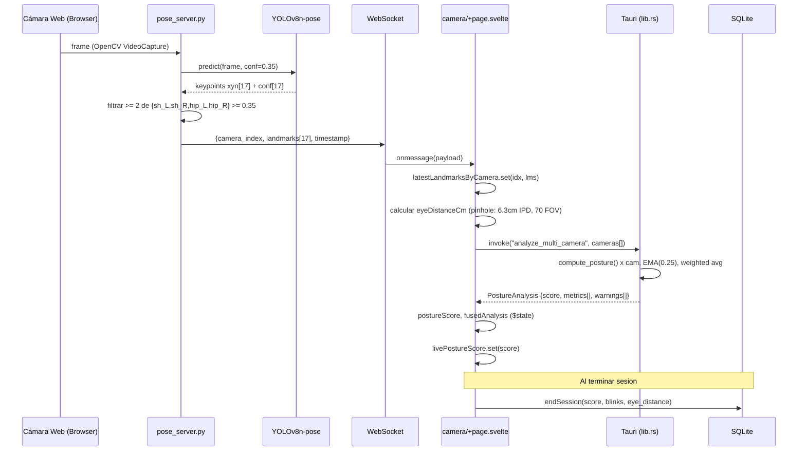
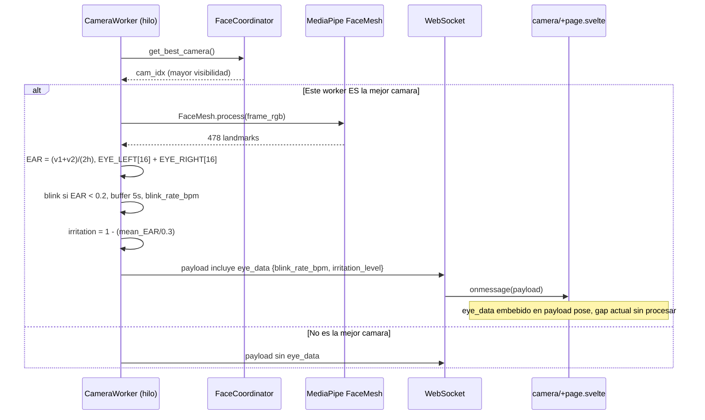
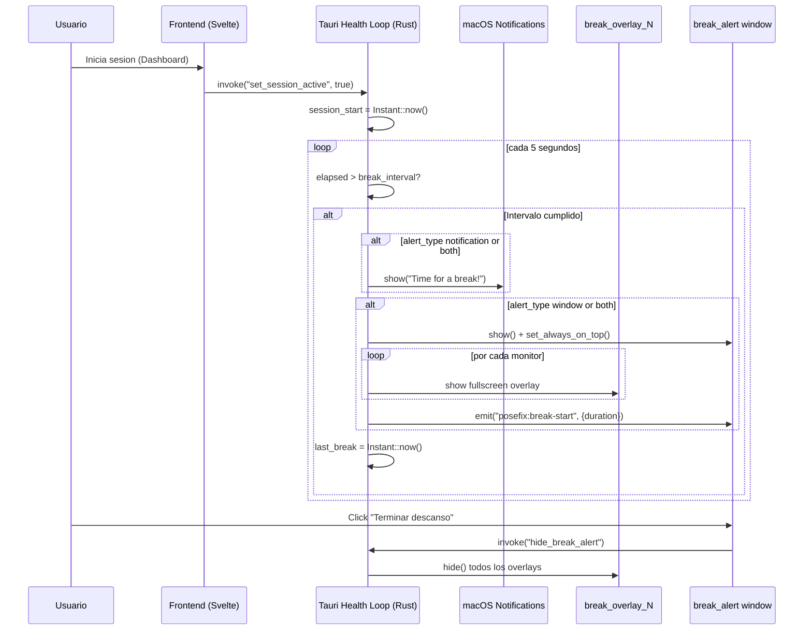
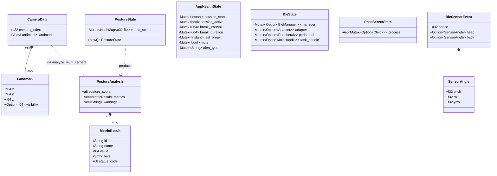
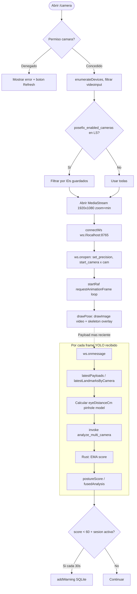

# Reporte Técnico: Proyecto PoseFix
**Sistema Híbrido de Monitoreo Postural y Salud Ocupacional**

## 1. Resumen
PoseFix es una solución integral de salud ocupacional diseñada para entornos de escritorio (macOS). El sistema aborda el sedentarismo y los problemas ergonómicos mediante un enfoque de monitoreo dual: sensores inerciales (*wearables*) y visión computacional (IA). 

A diferencia de otras soluciones, PoseFix opera bajo un paradigma de **Privacidad por Diseño**, ejecutando el procesamiento de IA y el almacenamiento de datos de forma 100% local (offline), eliminando riesgos de seguridad asociados a la nube. El objetivo principal es proporcionar feedback en tiempo real sobre la postura cervical/torácica y la fatiga visual, integrando ejercicios correctivos y estadísticas de progreso.

---

## 2. Stack Tecnológico

| Capa | Tecnología | Descripción |
| :--- | :--- | :--- |
| **Frontend** | Svelte 5 (Runes) | Framework reactivo de alto rendimiento. |
| **UI/UX** | Tailwind CSS v4 | Estilizado moderno y utilitario. |
| **Visualización** | LayerChart / Lucide | Gráficas complejas y set de iconos ergonómicos. |
| **Core Desktop** | Tauri v2 (Rust) | Orquestador nativo y seguridad de memoria. |
| **Base de Datos** | SQLite (Modo WAL) | Motor local con migraciones gestionadas por plugin. |
| **Visión / IA** | YOLOv8-pose / Python | Modelo de estimación de pose en tiempo real. |
| **Hardware** | ESP32-S3 / BNO055 | Procesamiento de orientación absoluta (9 ejes). |
| **Comunicación** | BLE / WebSockets | Protocolos de baja latencia para sensores e IPC. |

---

## 3. Arquitectura del Sistema

El sistema utiliza una arquitectura de **Lazo de Retroalimentación Híbrido**.

### Capas de Interacción:
1.  **Capa de Sensores (Hardware):** Un ESP32-S3 Sense recolecta datos de dos sensores BNO055 (cervical y torácico). Los datos se cifran (AES) y se transmiten vía BLE tras un *handshake* de seguridad.
2.  **Capa de Visión (Subproceso):** El `pose_server.py` (proceso hijo de Tauri) gestiona la cámara mediante OpenCV y ejecuta inferencia YOLOv8-pose. Se comunica con el frontend mediante un WebSocket local (`ws://localhost:8765`).
3.  **Capa de Orquestación (Tauri/Rust):** Gestiona el ciclo de vida de los procesos, la persistencia en SQLite y la lógica de fusión de datos (promedios ponderados y suavizado EMA).
4.  **Capa de Presentación (SvelteKit):** Renderiza la UI, maneja el estado global de la sesión y las visualizaciones de LayerChart.

### Diagrama de Flujo de Datos (ASCII):
```text
[Wearable Sensor] --(BLE/AES)--> [Tauri (Rust)] <==> [SQLite Local]
                                     ||
                               (Tauri Commands)
                                     ||
[Cámara Web] --(OpenCV)--> [Pose Server (Python)] <--(WS)--> [Dashboard (Svelte)]
                                |
                         [YOLOv8 Inference]
```

---

## 4. Páginas y Funcionalidades

| Ruta | Nombre | Funcionalidad Clave |
| :--- | :--- | :--- |
| `/` | Dashboard | Vista general, gauge de postura (PieChart) y tips del día. |
| `/camera` | Monitor | Visualización de landmarks YOLO y feedback visual. |
| `/progress` | Progreso | Análisis histórico semanal (LineChart) de scores posturales. |
| `/exercises` | Ejercicios | Integración con ExerciseDB API para pausas activas. |
| `/gallery` | Historial | Galería de sesiones anteriores y eventos de advertencia. |
| `/export` | Exportar | Generación de reportes detallados en formato JSON y PDF. |
| `/settings` | Configuración | Escaneo BLE, gestión de cámara y personalización (ES/EN). |
| `/account` | Perfil | Gestión de metas diarias y datos biométricos básicos. |

---

## 5. Esquema de Base de Datos (SQLite)

El diseño de la base de datos prioriza la integridad relacional y el rendimiento en consultas de agregación.

-   **`users`:** Almacena perfil, `posture_goal` y `avatar_path`. El campo `username` actúa como identificador único para la lógica de auth local.
-   **`sessions`:** Registra el histórico de uso. Incluye un campo `sensor_data` (JSON) para análisis granular post-sesión.
-   **`warnings`:** Almacena cada evento de mala postura detectado (tipo, gravedad, duración).
-   **Vistas Optimización:**
    -   `weekly_stats`: Proporciona medias de score y totales de duración agrupados por día.
    -   `session_summaries`: Clasifica la postura en categorías clínicas: **EXCELLENT (≥95), GOOD (≥80), FAIR (≥60), POOR (<60)**.

---

## 6. Evolución Cronológica (Timeline)

-   **Fase 0 (Abril 3-4):** Cimentación. Setup de Tauri + SvelteKit. Implementación de AES en firmware.
-   **Fase 1 (Abril 4-5):** Persistencia. Migración de SQLite y sistema de autenticación local.
-   **Fase 2 (Abril 5-6):** Visualización. Integración de LayerChart y rediseño de UI con Tailwind 4.
-   **Fase 3 (Abril 5-15):** Inteligencia. Integración de YOLOv8-pose y reglas de goniometría (Norkin & White).
-   **Fase 4 (Abril 15-27):** Conectividad. Reescritura del sensor ESP32 para soporte BLE nativo en lugar de IP.
-   **Fase 5 (Mayo 2026):** Estabilidad y Background. Implementación de System Tray, modo segundo plano y sistema de descansos programables.
-   **Fase 6 (Mayo 13, 2026):** Salud Visual y i18n. Implementación de estimación de distancia ojo-monitor y soporte multilenguaje completo en ajustes.

---

## 7. Sistema de Descansos y Background Mode

Para garantizar una protección continua sin interrumpir el flujo de trabajo, PoseFix implementa un motor de ejecución en segundo plano persistente.

### Funcionalidades Clave:
1.  **System Tray (Barra de Menú):**
    -   Muestra el estado en tiempo real (PF: [Analizando]).
    -   Contador de tiempo de sesión y cronómetro para el próximo descanso directamente en el título del tray (macOS).
    -   Acceso rápido para restaurar la ventana o salir de la aplicación.
2.  **Ciclo de Vida Persistente:**
    -   La aplicación intercepta el evento de cierre (`Cmd+W` o botón cerrar).
    -   En lugar de terminar el proceso, la ventana se oculta (`hide`), manteniendo activa la lógica de análisis y los temporizadores en Rust.
3.  **Gestor de Salud (Health Engine):**
    -   **Frecuencia configurable:** Ajuste de intervalos de trabajo (15-120 min).
    -   **Duración de pausa:** Definición de tiempo de descanso sugerido.
    -   **Notificaciones Nativas:** Envío de recordatorios mediante el sistema de notificaciones de macOS al cumplirse el intervalo.

### Arquitectura de Fondo:
La lógica de tiempo reside en un hilo dedicado de Rust (`tauri::async_runtime`), lo que asegura que los recordatorios funcionen incluso si el motor de renderizado de la interfaz está pausado por el sistema operativo para ahorrar energía.

---

## 8. Salud Visual (Eye Health)
PoseFix utiliza la cámara para estimar la distancia entre el usuario y el monitor, promoviendo hábitos que reducen la fatiga visual.
- **Modelo Pinhole**: Estimación basada en el ancho del video y la distancia interpupilar estándar (6.3cm).
- **Alertas Proactivas**: El sistema notifica visualmente si el usuario se mantiene fuera del rango recomendado (50-70cm).

---

## 9. Registro de Bugs y Soluciones

| Bug | Síntoma | Causa Raíz | Solución |
| :--- | :--- | :--- | :--- |
| **Símbolo Duplicado** | Fallo de compilación Tauri | Doble inclusión de `embed_plist`. | Remoción de dependencia externa; Tauri ya incluye la macro. |
| **SIGABRT BLE** | Crash al escanear Bluetooth | Denegación de permiso TCC en macOS. | Configuración de `entitlements.plist` y re-firma ad-hoc del binario. |
| **TCC macOS 26** | Crash instantáneo en Tahoe | TCC bloquea binarios fuera de `.app`. | Uso de `linker-wrapper.sh` y shim para ejecutar desde el bundle. |
| **Comando ble_scan** | 'Command not found' en bundle | WebView conectada a cache viejo sin Vite. | Workflow unificado: siempre iniciar Vite antes de abrir el `.app`. |
| **i18n Settings** | Textos en ES/EN mezclados | Falta de claves en archivos de traducción. | Migración completa a `$t()` para secciones Health y AI. |
| **Tray Icon Tahoe** | Icono desaparece al cerrar | `set_activation_policy` rompe el tray en Tahoe. | Eliminación de política de activación; `TrayIcon` en managed state. |

---

## 10. Features Agregados y Removidos

-   **Agregado:** Sistema de atajos de teclado globales para navegación rápida en escritorio.
-   **Agregado:** Handshake de seguridad BLE para prevenir *sniffing* de datos biométricos.
-   **Agregado:** Estimación de distancia ojo-monitor mediante visión computacional.
-   **Cambiado:** El sensor basado en IP (WiFi) fue descartado por alta latencia y consumo energético, siendo reemplazado por **BLE 5.0**.
-   **Cambiado:** El motor de IA pasó de ser un proceso independiente a un subproceso gestionado directamente por el ciclo de vida de Tauri (Tauri Sidecar).
-   **Agregado:** MediaPipe Face Mesh con FaceMeshCoordinator (solo la mejor cámara corre Face Mesh).
-   **Agregado:** Métricas oculares en tiempo real: EAR, blink rate, irritation level.
-   **Agregado:** Visualización de face landmarks en canvas con grupos coloreados y toggle on/off.
-   **Agregado:** Skeleton YOLO mejorado: colores por zona corporal (cara=cyan, torso=indigo, brazos=emerald, piernas=naranja) con opacidad por visibility.
-   **Agregado:** AI Smart Tips (ai-client.ts): tips personalizados via AI con anti-prompt-injection.
-   **Agregado:** Ergonomics Coach chat (ai-chat.ts): chat restringido a ergonomía/salud con disclaimer obligatorio.
-   **Agregado:** Rust WS Bridge para mantener score activo en segundo plano.
-   **Removido:** Botón de autenticación con Google (OAuth no implementado).

---

## 11. Estado Actual y Pendientes

**Estado:** Prototipo funcional de alta fidelidad (v0.8).
-   **Completado:** Core de visión, persistencia, UI reactiva y comunicación BLE.
-   **En Progreso:** Refactorización del store `ble.ts` para mayor robustez en reconexiones.
-   **En Progreso:** Finalización de la política de activación del Dock para modo Accesorio.
-   **Pendiente:** Test de estrés prolongado con hardware real para validar el consumo de batería del ESP32.
-   **Pendiente:** Integración final del motor de consejos dinámicos (AI Store).

---

## 12. Notas Técnicas Importantes

-   **Inferencia Paralela:** El `pose_server` utiliza `CameraWorker` con hilos dedicados para evitar bloqueos en el event loop de Python, permitiendo inferencia multihilo real si se conectan varias cámaras.
-   **Goniometría Clínica:** Los umbrales de advertencia no son arbitrarios; se basan en estándares de goniometría clínica para ángulos de inclinación cervical y torácica.
-   **Latencia IPC:** La comunicación vía WebSocket localhost mantiene una latencia de ~0.3ms, lo cual es despreciable comparado con los 30-50ms de procesamiento de YOLO.
- **Seguridad macOS:** Se implementó un script de re-firma (`resign-dev.sh`) para asegurar que las capacidades de Bluetooth y Cámara sean reconocidas correctamente por el sistema TCC (Transparency, Consent, and Control) de Apple durante el desarrollo.

---

## 13. Diagramas del Sistema

### 13.1 Diagrama Entidad-Relación (Base de Datos)



### 13.2 Diagrama de Arquitectura del Sistema



### 13.3 Diagrama de Secuencia — Flujo de Detección de Postura



### 13.4 Diagrama de Secuencia — Detección Visual de Ojo (MediaPipe)



### 13.5 Diagrama de Secuencia — Sistema de Recordatorio de Descansos



### 13.6 Diagrama de Componentes — Tipos Rust (lib.rs)



### 13.7 Diagrama de Flujo — Ciclo de Vida de Camara


